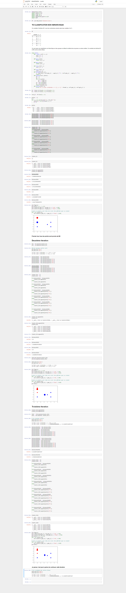

# Classification non Hiérarchique et Hiérarchique
Dans cette activité, je vais mettre en pratique mes connaissances théorique 
de la classification Hiérarchique et non Hiérarchique avec le langage **Python** et 
L'outil **SPSS**  

